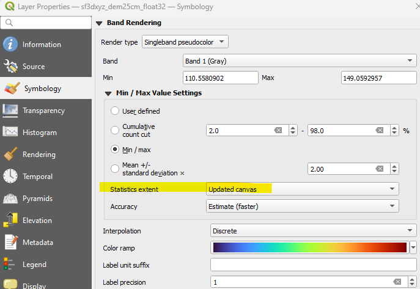

# Brown Bag # 6: Shiny with Nicholas Bear

1. Sample Shiny app with color ramp adjusted to extents
  * https://github.com/mrnickbear/color-extent
2. Mastering Shiny by Hadley Wickham
  * https://mastering-shiny.org/
3. R Libraries discussed
  * Shiny
  * Mapview
  * Stars
4. Minimal Mapview R script
```r
library(sf)
library(mapview)
#fill in your own sample file instead of the highlighted path below
#also I will try to make an example using Marc Uscilka's sfrb.dataSF library
streets <-  read_sf("K:\\sfbase\\arcview\\SFCity\\ACTIVESTREETS\\activestreets.shp")
mapview(streets)
```

5. QGIS setting "Statistics extent: Updated canvas"



6. Shiny and Leaflet
  * https://rstudio.github.io/leaflet/articles/shiny.html
  * Superzip example  https://shiny.posit.co/r/gallery/interactive-visualizations/superzip-example/
  * One app per instance of R
    * Start multiple instances of RStudio
    * Or make a shell script that starts the app.  I have a folder with all the scripts to start my apps such as after the PC restarts.  I also save the link to all the apps in that folder for testing.
